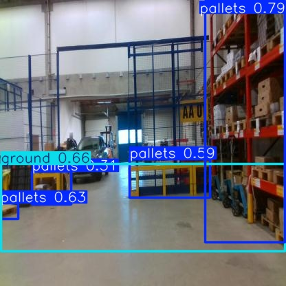
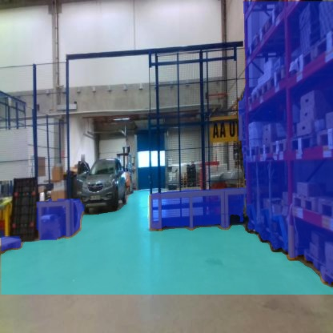
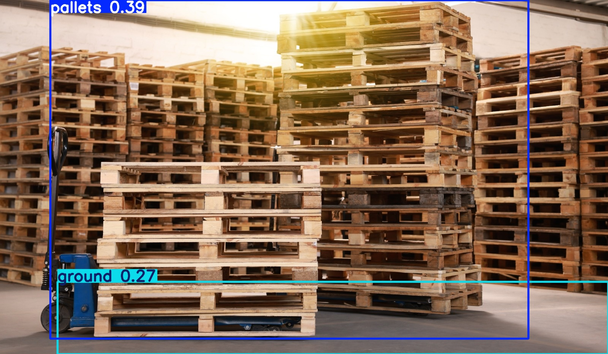
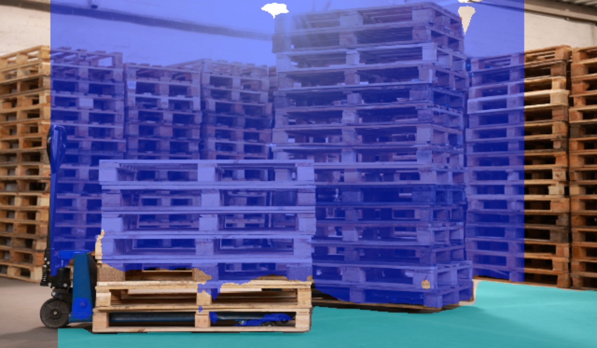
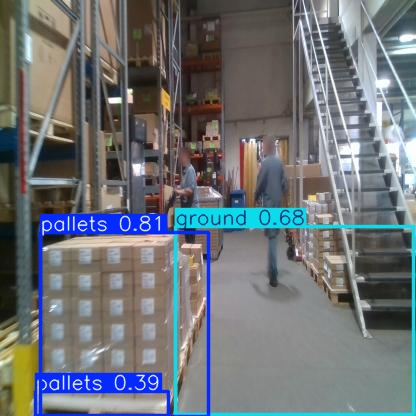
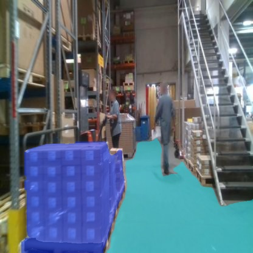

# Creating the docker image
- Download the docker file from this repository.
- Open a terminal in the downloaded folder.
- Run the command ```docker build -t <image-name> .```
- This docker will take around 10-30 minutes depending on the internet connection and processing power
- The created image will have ros2 humble, turtlebot4 packages, rviz2, gazebo, torch, ultralytics, cv2 installed.

# Running the docker image
- To run the docker image in linux:
```docker run --privileged --rm -it --gpus all --net=host -v /tmp/.X11-unix:/tmp/.X11-unix -e DISPLAY=$DISPLAY --device /dev/video0:/dev/video0 <image-name>```
- To run the docker image in windows:
    1. Install vcxsrv from sourceforge.
    2. Launch with all the checkboxes selected in the advanced configuration.
    3. Run ```ipconfig```
    4. Open PowerShell (in administrator mode) and run ```Set-Variable -name DISPLAY -value <Your IPV4 Address>:0.0```
    5. Run the docker command ```docker run -it --rm --privileged --gpus all -e DISPLAY=$DISPLAY <image-name>```
    6. Map the hardware with ```/dev/video0``` if you have experience linking the hardware with docker containers in windows host. This hasn't been successful from my end. If the code needs to be changed, read the instructions from `Possible Modifications`

# Install required dependencies
- Run the command ```bash initial_setup.sh```. This will fix the required dependencies for cv_bridge.

# Setup ROS Workspace
- Run the command ```cd /ros_ws/src```
- Clone the repository. The folder structure of ros_ws/src should look like this
```
    ├── Dockerfile
    ├── pallet_detection
    │   ├── launch
    │   │   └── inference_launch.py
    │   ├── package.xml
    │   ├── pallet_detection
    |   |   ├── __init__.py
    │   │   ├── img_publisher.py
    │   │   ├── img_subscriber.py
    │   │   └── bag.py
    │   ├── resource
    │   │   └── pallet_detection
    │   ├── setup.cfg
    │   ├── setup.py
    │   ├── test
    │   │   ├── test_copyright.py
    │   │   ├── test_flake8.py
    │   │   └── test_pep257.py
    │   ├── val_images
    │   │   ├── img1.jpeg
    │   │   └── img2.jpeg
    │   ├── internship_assignment_sample_bag
    │   │   ├── internship_assignment_sample_bag_0.db3
    │   │   └── metadata.yaml
    │   └── yolo
    │       ├── best.pt
    │       ├── test_image.jpg
    │       └── yolo11n.pt
    │── README.md
    │── Grounded_Dino.ipynb
    │── yolov11.ipynb
    └── inferences
        ├── detection1.jpg
        ├── detection2.jpg
        ├── detection3.jpg
        ├── segmentation1.jpg
        ├── segmentation2.jpg
        └── segmentation3.jpg
```
- Run the command ```cd /ros_ws```
- Run ```colcon build``` to build the package pallet_detection.

# Run the inference

## With images recorded in the bag file
Put your bag file (.db3 file and metadata.yaml) in `/pallet_detection/internship_assignment_sample_bag` (As showin in the folder structure above) and change the folder path and file name accordingly in `/pallet_detection/pallet_detection/bag.py` (in line 72) and adjust the topic name in line 48 as needed.
To run inference on images in bag file :

 ```ros2 run pallet_detection bag.py```

## With video device
- To launch the publisher and subscriber with the default video device, run the command ```ros2 launch pallet_detection inference_launch.py```

# Possible Modifications
- If you have any other camera devices connected with different `/dev/<device>` mapping in the host, map the device while running the docker container to `/dev/video0`. For example ```docker run --privileged --rm -it --gpus all --net=host -v /tmp/.X11-unix:/tmp/.X11-unix -e DISPLAY=$DISPLAY --device /dev/<deviceN>:/dev/video0 <image-name>```. 
- If the above command doesn't work (not tested as I donot have a USB camera,) open img_publisher.py and change the device mapping in line where cv2.VideoCapture() object is created. For this, make sure that the docker run command is run without any device mapping discrimination.

# Possible errors
- If an error with Qt is encountered, run the command ```xhost +local:docker```

# Training and saving model weights

## Generating ground truth bounding boxes for pallets and ground using Grounding-DINO
- Follow notebook `/Grounded_Dino.ipynb` 

## Generating semantic segmentation ground truth using SAM and Training (Fine tuning) yolov11 
- Follow notebook `/yolov11.ipynb` (mAP and IOU curves are present for detection and segmentation)
- model weights saved in `/pallet_detection/yolo`

# Sample runs (inferences on fine tuned model) 
 ## Image 1 detection
 
 ## Image 1 segmentation

 <!-- ## Image 2 detection

 ## Image 2 segmentation
 -->

 ## Image 2 detection


 ## Image 2 segmentation


## Image 3 detection


 ## Image 3 segmentation
